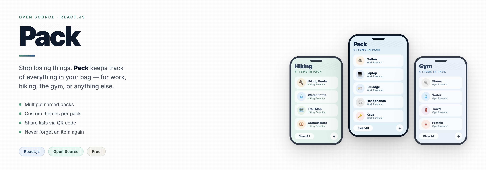
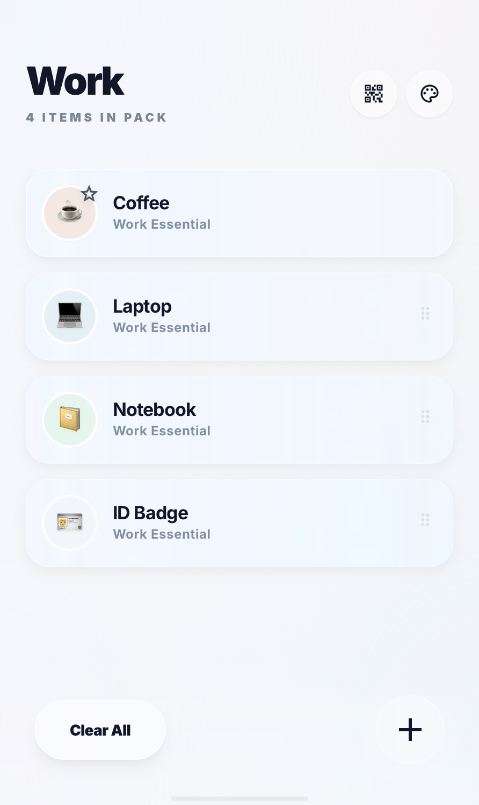
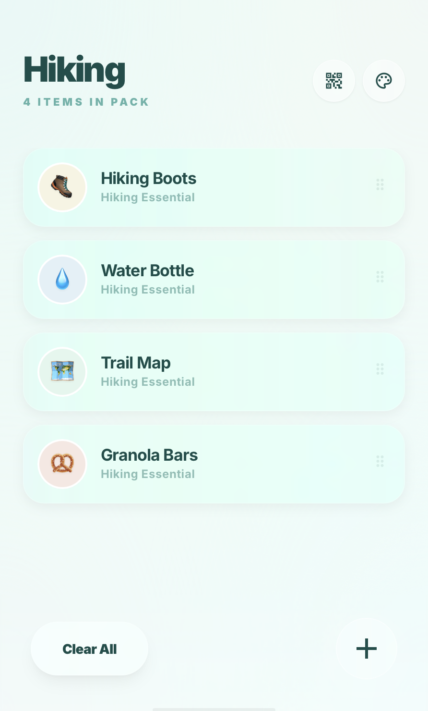
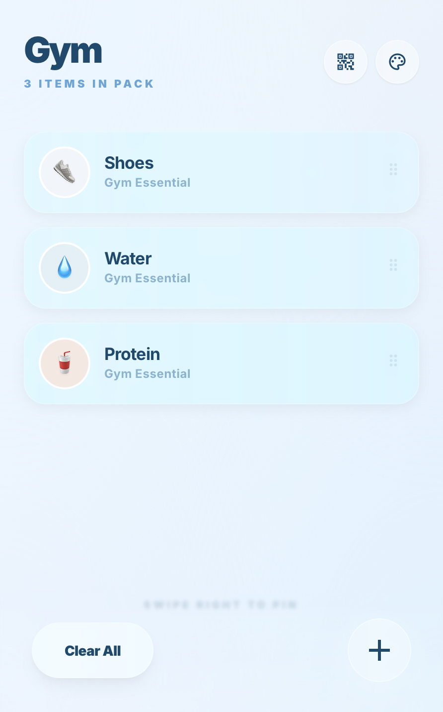
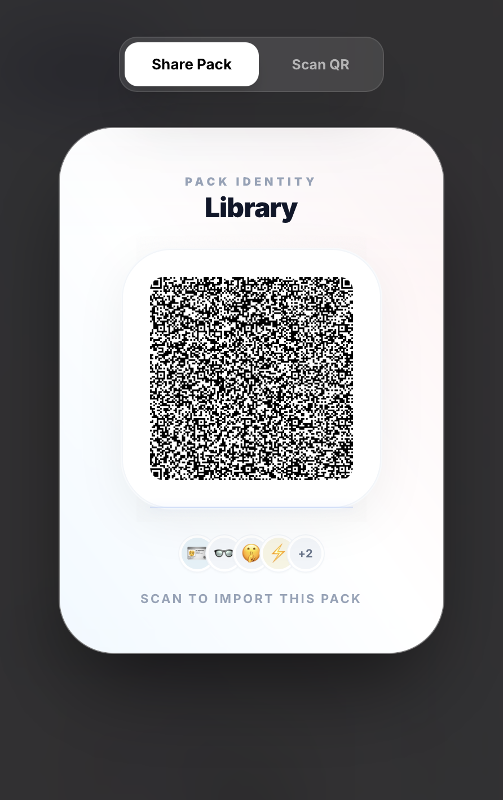
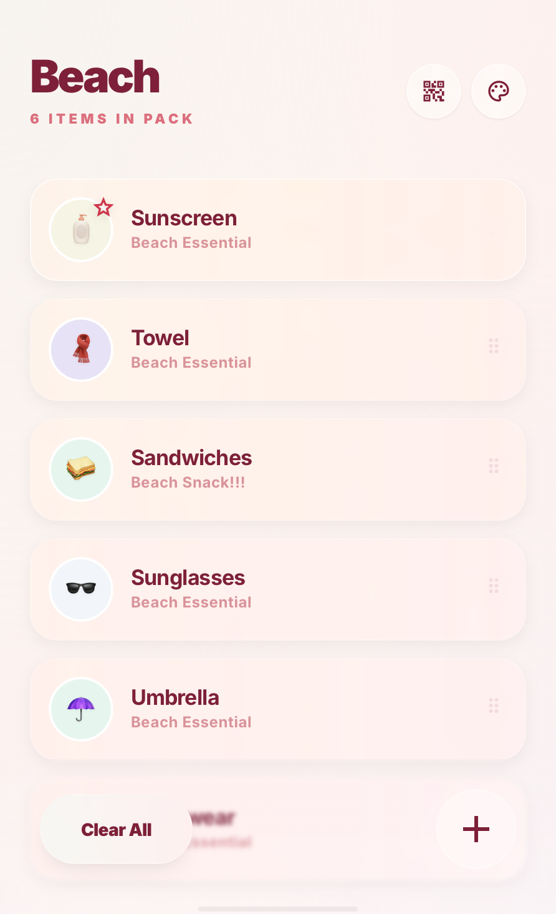

<div align="center">

</div>

# Pack

Simple item tracking so you don't forget your stuff.

I made Pack because I'm a clumsy person. I kept leaving things behind; headphones in an Airbnb, my laptop charger in a rental car, coffee tumbler at a coworking spot. It was annoying.

So I built this: a dead-simple app that lets you create reusable packs (Work, Hiking, Gym, whatever) and quickly check what you need before heading out.

No accounts. No ads. No unnecessary features.

Just open the app, pick a pack, and go.

## What it does

- Create different packs for different parts of your life
- Add items with simple icons
- Share your pack instantly with a QR code
- Clean empty state when your pack is ready to go

## Screenshots







## Try it

Live demo: [Vercel](https://pack-341b5weit-g6b1s-projects.vercel.app/)

## Local Development

```bash
git clone https://github.com/g6b1/Pack.git
cd pack
npm install
npm run dev
